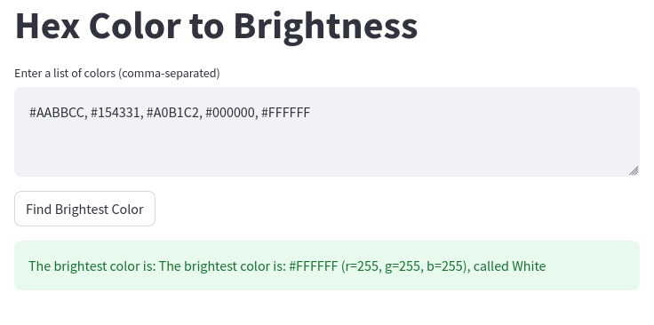

# Vispiron Challenge: Hex Color Value to Brightness


## Task

Hexadecimal color values are used for color values in frontend programming, i.e. the RGB components are coded as hexadecimal values in the interval from 00 to FF, where FF corresponds to the decimal number 255:

(F = 15, FF = 15 * 16 + 15 * 1 = 240 + 15 = 255)

In this representation, the color 'white' is coded as "#FFFFFF", the color 'black' is coded as "#000000", and 'red' is coded as "#FF0000."

 

The brightness of a color is determined by the formula sqrt(0.241 R^2 + 0.691 G^2 + 0.068 B^2).

 

Your task is to select the brightest color from a list of color values and output the red, green and blue components individually.

Demonstrate that you can use principles of object-oriented design in a meaningful way, as well as master the standard Python APIs.

 

Example input: list = ["#AABBCC", "#154331", "#A0B1C2", "#000000", "#FFFFFF"]

Output to the example input: "The brightest color is: #FFFFFF (r=255, g=255, b=255)"

 

Please also make sure to tell/show me how you tested the correctness of your functionality.

 

As a bonus (if you have some time left and/or some extra motivation):

Enhance the output by the name of the brightest color.

To solve this task, please use the API posted at https://www.csscolorsapi.com/ in your Python source code and implement an algorithm to find the most suitable color name.


# Color Matcher Application

## Overview

This project is a web application that helps you find the closest CSS color name for a given color using a simple and intuitive interface.



## Technology Stack

- **Frontend**: Streamlit
- **Backend**: FastAPI
- **Color Data Source**: CSS Colors API (https://www.csscolorsapi.com/)

## Prerequisites

- Python 3.12
- Poetry (Dependency Management)

## Installation

1. Ensure you have Python 3.12 installed
2. Install Poetry:
   ```bash
   pip install poetry
   ```
3. Clone the repository
4. Install dependencies:
   ```bash
   poetry install
   ```

## Running the Application

### Backend Server

From the project root directory, start the FastAPI backend:
```bash
uvicorn backend.app.main:app --reload
```

### Frontend Interface

From the project root directory, launch the Streamlit frontend:
```bash
streamlit run frontend/app.py
```


### Docker Setup
Build the Docker containers:
```bash
docker-compose build
```

Start the application:
```bash
docker-compose up
```
